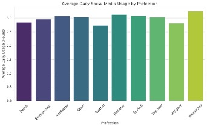

# Predicting Social Media E-Commerce Conversions

**Course:** ISOM 835 – Predictive Analytics and Machine Learning  
**Institution:** Sawyer Business School, Suffolk University  

## Quick Links
* 📄 **[Read the Full Final Business Report (PDF) Here](./05.04.26%20-%20Caitie%20Kelly%20-%20Term%20Project.pdf)**
* 💻 **[View the Interactive Google Colab Notebook Here](https://colab.research.google.com/drive/1P7u0sUMh_xmhFr-UESEMhx8JUTdtVQNd?usp=sharing)**

---

## Project Summary
In the modern digital economy, understanding how different demographics interact with social media platforms is a fundamental business necessity. This project applies the complete machine learning lifecycle to analyze user behavior within social media environments. The analysis focuses on forecasting e-commerce conversions, addressing class imbalance in predictive modeling, and evaluating the impact of digital habits on user well-being.

## Project Objectives
This analysis aims to accomplish the following core objectives:
* **Exploratory Data Analysis (EDA):** Identify patterns, distributions, and behavioral anomalies within social media usage data across different demographics.
* **Data Preprocessing:** Prepare a multidimensional dataset for machine learning through categorical encoding, feature scaling, and train/test splitting.
* **Predictive Modeling:** Train, tune, and evaluate at least two classification models (Logistic Regression and a hyperparameter-tuned Random Forest) to predict whether a user will make a purchase via social media.
* **Business Insight Generation:** Extract actionable recommendations for digital marketing strategies, targeted advertising, and platform design based on feature importance and model evaluation metrics.

## Dataset Description and Source
* **Name:** Social Media User Behavior
* **Source:** Open Data Portals / Kaggle
* **Description:** This project utilizes the Social Media User Behavior dataset (2,000 observations, 34 features), selected for its rich intersection of continuous and categorical variables. It provides a robust, real-world foundation for predicting e-commerce conversions (`purchased_via_social_media`) while offering multidimensional data to explore digital wellbeing and platform engagement.

## Tools and Libraries Used
* **Language:** Python
* **Environment:** Google Colab
* **Data Manipulation:** `pandas`, `numpy`
* **Data Visualization:** `matplotlib`, `seaborn`
* **Machine Learning:** `scikit-learn` (LogisticRegression, RandomForestClassifier, StandardScaler, GridSearchCV, ConfusionMatrixDisplay)

---

## Project Workflow & Key Insights

### 1. Exploratory Data Analysis (EDA)
Extensive EDA was conducted to map user demographics against digital habits. Visualizations, including a Correlation Heatmap, confirmed a lack of multicollinearity among numerical features. A Scatter Plot (Age vs. Daily Usage) revealed no strong linear relationship, while Bar and Box Plots demonstrated that high usage hours span across all professions and global regions. Count Plots further detailed a balanced distribution across primary platforms (e.g., TikTok, Instagram) and user purposes (e.g., Entertainment, Socializing). 

**Age vs. Daily Social Media Usage** 

**Distribution of Daily Usage by Country** 

**Average Daily Usage by Profession** 

### 2. Formulating Business Analytics Questions
The predictive modeling workflow was guided by three stakeholder-centric questions:
* **Marketing Strategy:** What behaviors predict a user making a purchase via social media?
* **Product Design:** Can digital habits predict negative well-being outcomes like sleep disruption?
* **Platform Retention:** How do usage metrics influence the likelihood of a user experiencing digital burnout and taking breaks?

### 3. Predictive Modeling & Evaluation
Two classification models were deployed to predict purchasing behavior: a baseline Logistic Regression and a hyperparameter-tuned Random Forest Classifier (optimized via `GridSearchCV`). Both models achieved an overall accuracy of ~74%. However, the Confusion Matrix visual for the tuned Random Forest highlights a critical challenge with class imbalance—while the model easily identified non-purchasers (True Negatives), it struggled to capture the minority class of actual purchasers without more high-intent sequential data.

### 4. Insights and Answers
The analysis fundamentally shifts the recommended marketing strategy from demographic targeting to behavioral retargeting. As illustrated by the Feature Importance Bar Chart, a user's `ad_click_rate`, `daily_usage_hours`, and `followers_count` carry significantly more predictive weight than their age, gender, or preferred platform. For stakeholders, this confirms that how a user physically interacts with a platform is vastly more valuable for e-commerce conversion than their static demographic profile.

### 5. Ethics and Interpretability Reflection
Deploying predictive algorithms on social media data carries inherent risks of predatory targeting. Because variables like mental health scores and sleep disruption are present in the dataset, strict data governance is required to ensure vulnerable users are not algorithmically exploited for e-commerce gain. Furthermore, relying on complex ensemble models like Random Forests necessitates using explainable AI tools (like the feature importance charts provided) to ensure the logic behind targeted campaigns remains transparent to business stakeholders and users alike.

---

## Instructions: How to Open, Run, and View Results
The analysis, modeling, and visualizations were conducted entirely within a Google Colab notebook. 

**To reproduce the analysis and view the results:**
1. Click the **Google Colab Quick Link** at the top of this page to open the notebook.
2. Download the `social_media_user_behavior.csv` dataset directly from this GitHub repository.
3. In the Google Colab environment, click the **Folder icon** on the far-left sidebar to open the Files panel.
4. Click the **Upload icon** (or drag and drop) to upload the `social_media_user_behavior.csv` file into the Colab session space.
5. In the top menu bar, click **Runtime > Run all**. 
6. Scroll through the notebook to view the executed code, the generated EDA visualizations, the hyperparameter tuning progress, and the final model evaluation metrics (Accuracy, F1-Score, and Confusion Matrix).

